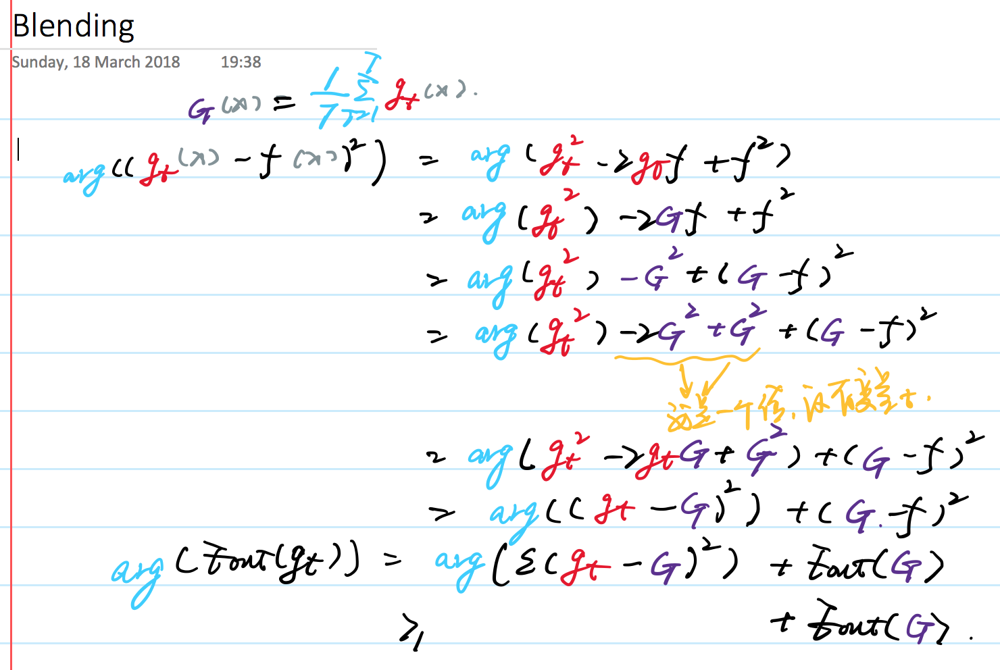

# Blending

Blending强调的是组合弱分类器的策略，而不强调产生不同模型的方式。组合模型的策略有线性组合，此时每个模型都有一个投票权重，当权重都一样的时候，即都是1时，称为Uniform Blending，如果权重不一样呢，我们一般称为Linear Blending；当然也有非线性组合，我们一般称为Stacking，决策树模型实际上就是这种方式。

## Uniform Blending(Voting)

这种方式有称为投票的方式，我们给每个模型的权重是一样的，都是1票：

- 对于二分类问题 $G(x) = sign(\sum_{t=1}^Tg_t(x))$，对于多分类问题 $G(x) = argmax_{1<=k<=K}\sum_{t=1}^T[g_t(x) = k]$
- 对于回归问题，我们对所有结果相加然后求平均：$G(x) = \frac{1}{T} \sum_{t=1}^T g_t(x)$

### 数学推导证明有效性

我们可以认为右边的第一项为variance，第二项为bias，我们希望通过降低variance的方式来是的模型的误差变小。

## Linear Blending

上面讨论的是均匀组合，但是，有时候我们需要给不同的模型以不同的权值。

即，$G(x) = sign(\sum_{t=1}^T \alpha_t g_t(x)) with \alpha_t >= 0 $

这时候我们需要通过计算，求得是的$E_{in}$最小的$\alpha$，如果选择损失函数为均方损失函数，我们就可以得到如下的表达式：$min_{\alpha_t >= 0} \frac{1}{N}\sum_{n=1}^N(y_n - \sum_{t=1}^T \alpha_t g_t(x_x))^2$

实践中，我们的做法都是，先在训练数据上选出最佳的单个模型，然后在验证集上进行权值的选择。

## Any Blending(Stacking)

我们可以不用线性组合的方式，而是进行其他的组合方式，这样的方式的另一个名称叫做Stacking。
