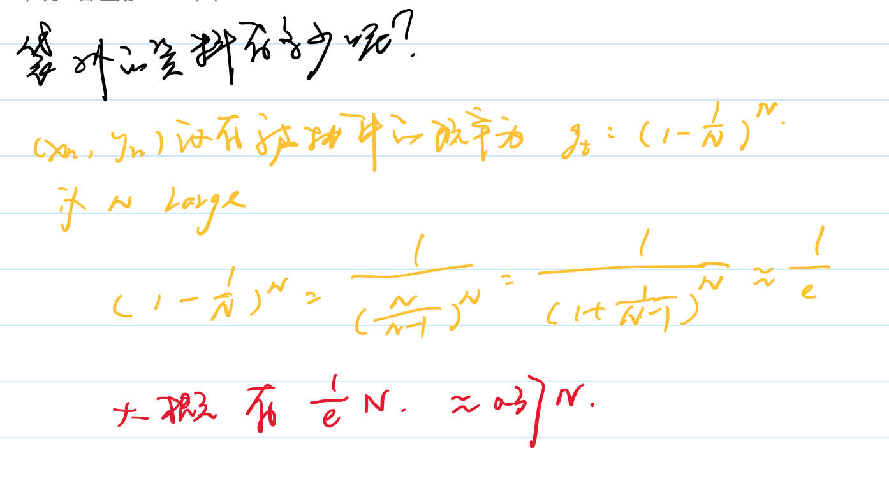

# Blending

Blending强调的是组合弱分类器的策略，而不强调产生不同模型的方式。

## Uniform Blending(Voting)

这种方式有称为投票的方式，我们给每个模型的权重是一样的，都是1票：

- 对于二分类问题 $G(x) = sign(\sum_{t=1}^Tg_t(x))$，对于多分类问题 $G(x) = argmax_{1<=k<=K}\sum_{t=1}^T[g_t(x) = k]$
- 对于回归问题，我们对所有结果相加然后求平均：$G(x) = \frac{1}{T} \sum_{t=1}^T g_t(x)$

### 数学推导证明有效性

我们可以认为右边的第一项为variance，第二项为bias，我们希望通过降低variance的方式来是的模型的误差变小。

## Linear Blending

上面讨论的是均匀组合，但是，有时候我们需要给不同的模型以不同的权值。

即，$G(x) = sign(\sum_{t=1}^T \alpha_t g_t(x)) with \alpha_t >= 0 $

这时候我们需要通过计算，求得是的$E_{in}$最小的$\alpha$，如果选择损失函数为均方损失函数，我们就可以得到如下的表达式：$min_{\alpha_t >= 0} \frac{1}{N}\sum_{n=1}^N(y_n - \sum_{t=1}^T \alpha_t g_t(x_x))^2$

实践中，我们的做法都是，先在训练数据上选出最佳的单个模型，然后在验证集上进行权值的选择。

## Any Blending(Stacking)

我们可以不用线性组合的方式，而是进行其他的组合方式，这样的方式的另一个名称叫做Stacking。

# Bagging

Bagging更加强调产生模型的方式。和Blending的目的是一样的。

但是，我们要得到不同的模型，我们通常有两种思路，一种就是用同一套模型，但是训练数据不一样，另外一种就是用不一样的模型。对于前者，我们需要考虑如何用已有的训练数据，产生出不一样的样本自己呢？一般都是采用`Bootstrap`的方式：先抓一个，记录下来，放回去，摇一摇，在抓一个…（注意这种抓取方式可能使得同一笔资料被抓取多次）。

通过根据训练子集获取方式的不同，可以分为以下几类：

- 随机取样——Pasting
- **有放回取样（Bootstrap）——Bagging** 这种采样方式，有$N!/N^N$种几率从N个样本抽取出来的样本和原来样本一样。
- 特征子集——Random Subspaces
- 样本和特征都是子集——Random Patches

所有选取样本子集的时候有两个方面要考虑，是否选取特征，是否为有放回选取。

在取样的时候，我们有时候拿袋外的样本当做测试样本。

那么这个袋外的资料有多少呢：

**是否可以用来做验证集？**

是的，但是要记住，在模型融合中，我们要的不是单个模型的最优，而是所有模型融合后的最优，所以我们希望用这些袋外数据来对G做验证集，具体如下:

对于$(x_i, y_i)$然后来交叉验证$G_{N}^-(x) = average(g_i, g_j, …, g_t)$，其中，这些g是单个模型，而且$(x_i, y_i)$对于这些模型是袋外。最后求总的验证误差 ： $E_{oob}(G) = \frac{1}{N}\sum_{n=1}^Nerr(y_n, G^-_n(x_n))$

