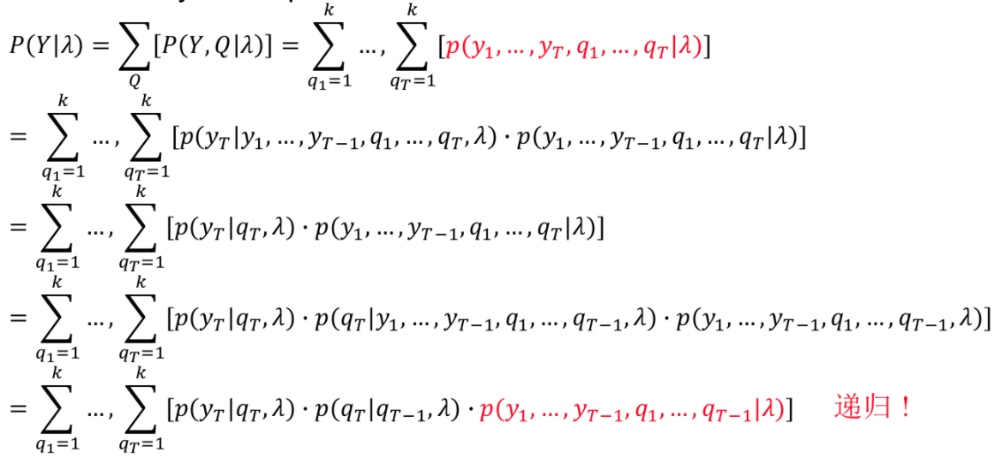
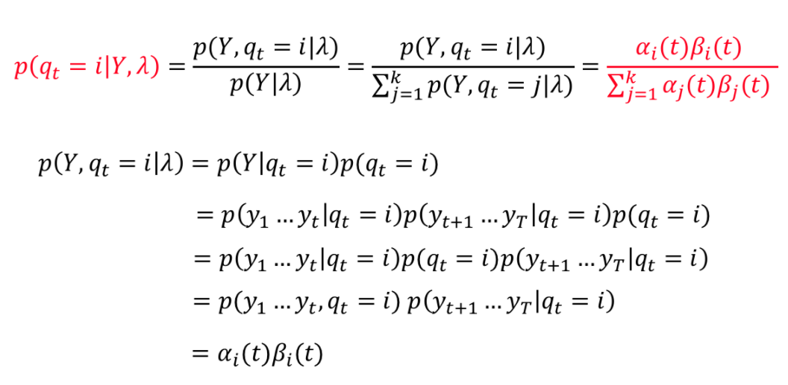

# 1. 三个基本要素和三个基本问题

隐马尔科夫模型由**三个参数**决定：

- **起始概率**
- **转移概率矩阵**
- **发射概率矩阵**

隐马尔科夫模型要解决**三个问题**：

- 给定模型参数和观测序列，**计算该观测序列似然**（**前向-后向**，动态规划）
- 给定观测序列，学习模型的参数（**Baum-Welch算法**，Expectation-Maximization）
- 给定模型参数和观测序列，预测概率最大的隐状态序列（**Viterbi algorithm**，动态规划）

隐马尔科夫发射概率一般为如下模型：

- `Gaussian`
- `Gaussian mixture`
- `Multinomial`

# 2. 概率计算

## 2.1 直接求解

直接求解的复杂度过高，为$O(k^T)$

## 2.2 前向-后向算法

### 前向算法

### 后向算法

### 求解单点隐变量概率

