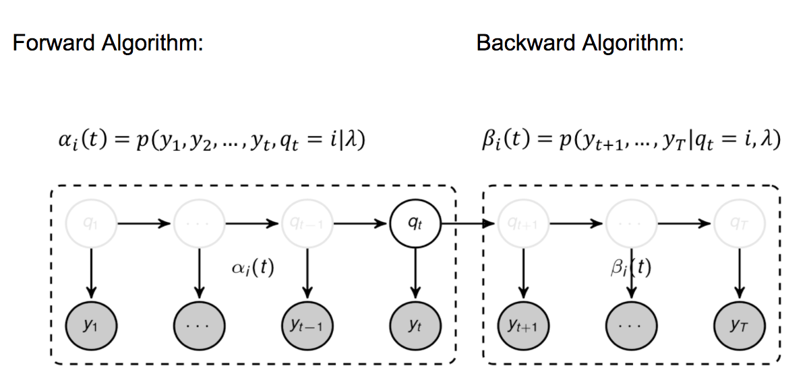

# 三个基本要素、三个基本问题、两个基本假设

隐马尔科夫模型的两个基本假设：

- $P(y_i|y_{i-1},y_{i-2},…,y_1,q_{i-1},q_{i-2},…,q_1)=P(y_i|q_i)$
- $P(q_i|y_{i-1},y_{i-2},…,y_1,q_{i-1},q_{i-2},…,q_1)=P(q_i|q_{i-1})$

隐马尔科夫模型由**三个参数**决定：

- **起始概率**
- **转移概率矩阵**
- **发射概率矩阵**

隐马尔科夫模型要解决**三个问题**：

- 给定模型参数和观测序列，**计算该观测序列似然**（**前向-后向**，动态规划）
- 给定观测序列，学习模型的参数（**Baum-Welch算法**，Expectation-Maximization）
- 给定模型参数和观测序列，预测概率最大的隐状态序列（**Viterbi algorithm**，动态规划）

隐马尔科夫发射概率一般为如下模型：

- `Gaussian`
- `Gaussian mixture`
- `Multinomial`

# 第一个基本问题：概率计算

## 直接求解

直接求解的复杂度过高，为$O(k^T)$

## 前向-后向算法

### 前向算法

### 后向算法

### 求解单点隐变量概率

# 第二个基本问题：解码问题

使用维特比算法求解，属于动态规划算法。

# 第三个基本问题：参数求解

