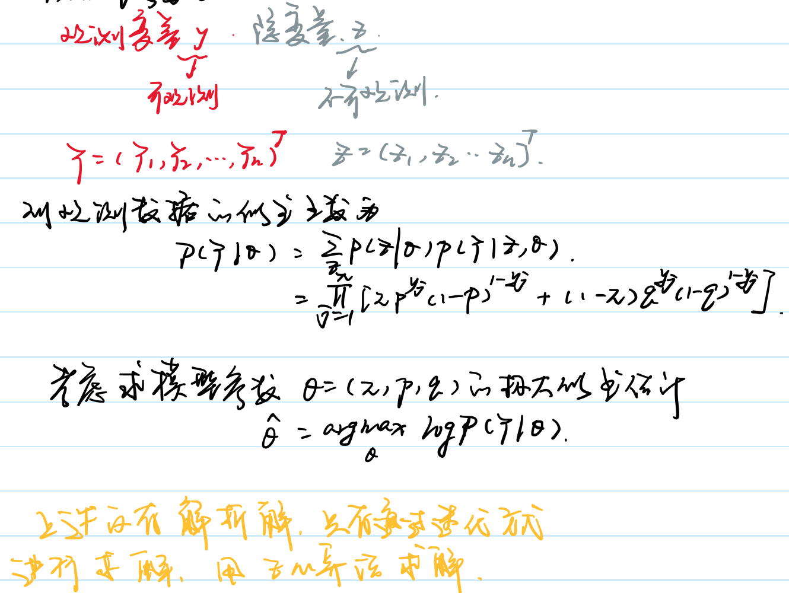
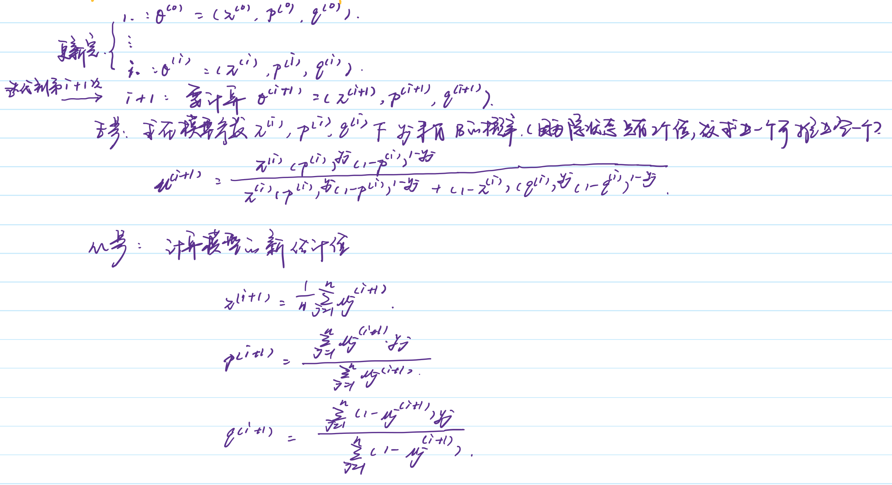
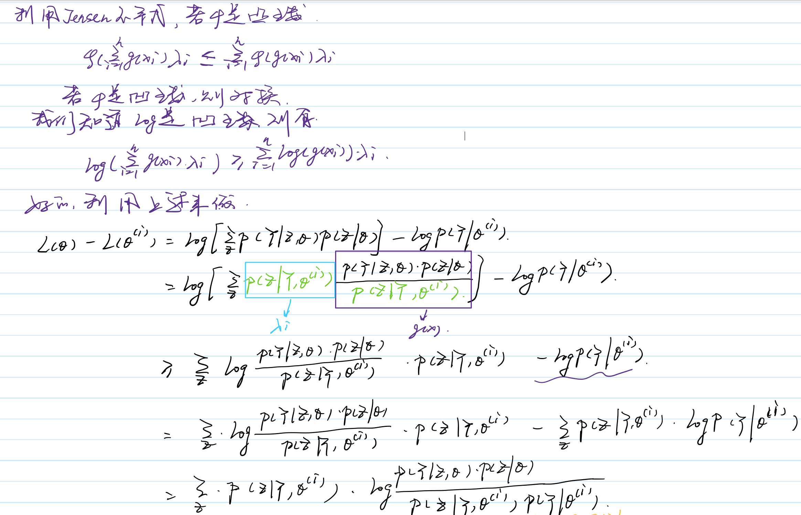
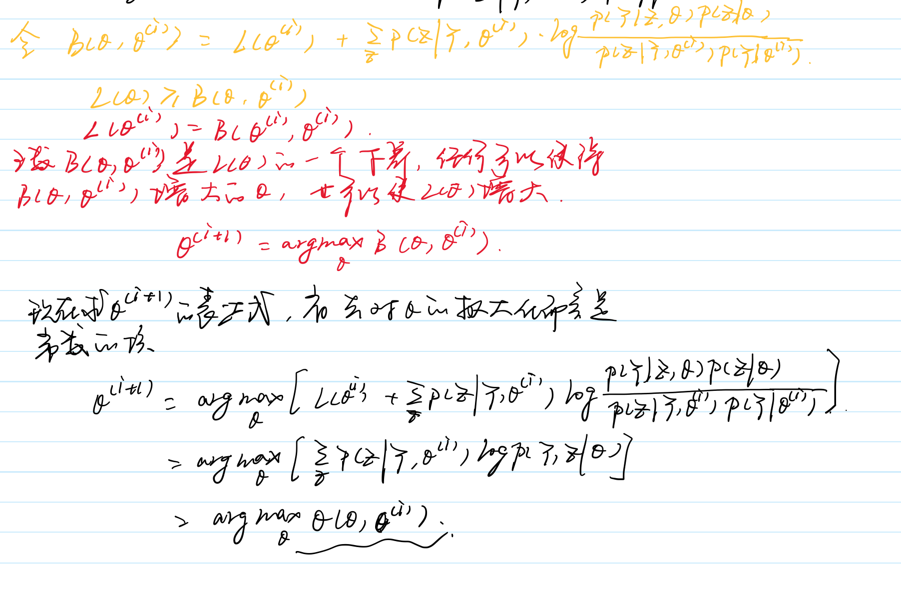
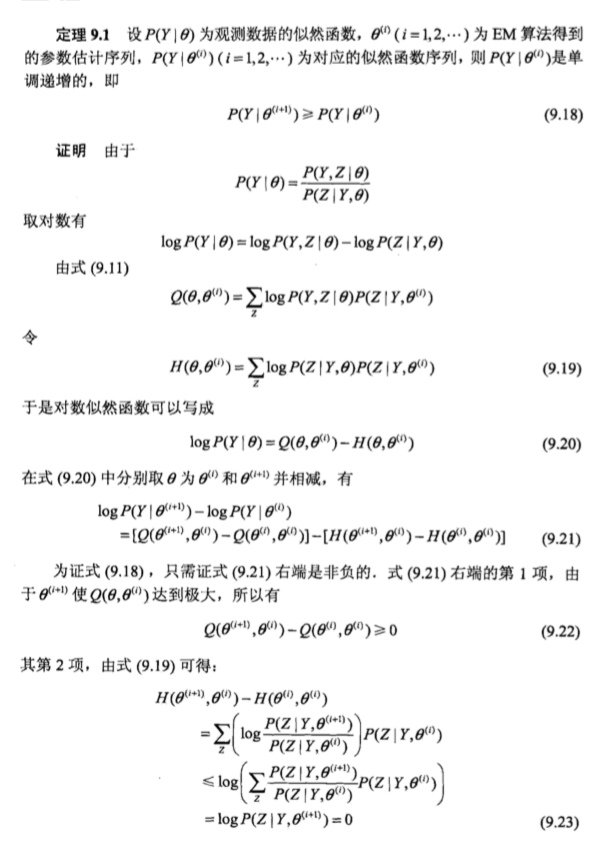

# EM

- 初始值的选择对EM来说非常重要。
- EM算法是含有隐变量的概率模型极大似然估计或极大后验概率估计的迭代算法。EM算法通过迭代求解观测数据的对数似然函数$L(\theta)=logP(Y|\theta)$的极大化，分两个步骤：
  - **E步**，求期望，即求$logP(Y,Z|\theta)$关于$P(Z|Y,\theta^{(i)})$的期望：
    - $Q(\theta,\theta^{(i)}) = \sum_ZlogP(Y,Z|\theta)P(Z|Y,\theta^{(i)})$
  - **M步**，求极大化Q函数得到参数的新估计值：
    - $\theta^{(i+1)} = argmax_{\theta}Q(\theta,\theta^{(i)})$
- 在一般条件下，EM算法是收敛的，但不能保证收敛到全局最优。
- EM算法应用极其广泛，主要应用于含有隐变量的概率模型的学习：
  - **混合高斯模型**
  - **隐马尔科夫参数学习问题**

### 例子

### 算法流程

输入：观测变量数据Y，隐变量数据Z，联合分布$P(Y,Z|\theta)$，条件分布$P(Z|Y,\theta)$

输出：模型参数$\theta$

（1）选择参数的初始值$\theta^0$，开始迭代

（2）**E步**：记$\theta^{(i)}$为第i次迭代参数$\theta$的估计值，在第i+1次迭代的E步，计算

$Q(\theta,\theta^{(i)})=E_z[logP(Y,Z|\theta)|Y,\theta^{(i)}] = \sum_zlogP(Y,Z|\theta)P(Z|Y,\theta^{(i)})$

（3）**M步**：求使$Q(\theta,\theta^{(i)})$极大化的$\theta$，确定第i+1次迭代的参数的估计值$\theta^{(i+1)}$

$\theta^{(i+1)} = argmax_{\theta}Q(\theta,\theta^{(i)})$

（4）重复第（2）步和第（3）步，直到收敛

### Q函数

完全数据的对数似然函数$logP(Y,Z|\theta)$关于在给定观测数据Y和当前参数$\theta^{(i)}$下对未观测数据Z的条件概率分布$P(Z|Y,\theta^{(i)})$的期望：

$Q(\theta,\theta^{(i)})=E_z[logP(Y,Z|\theta)|Y,\theta^{(i)}] = \sum_zlogP(Y,Z|\theta)P(Z|Y,\theta^{(i)})$

### 收敛性

