# Word2Vec

`word2vec`是一类神经网络模型，对于无标记的训练预料，可以为每个词产生一个包含语义信息的词向量。

- 我们可以比较不同词之间的语义相似度，通过计算对应的词向量的`cosin`距离。
- 我们把可以词向量当做特征，用于不同的有监督学习的NLP任务中，如文档分类、命名体识别和语义分析。

## One-To-One

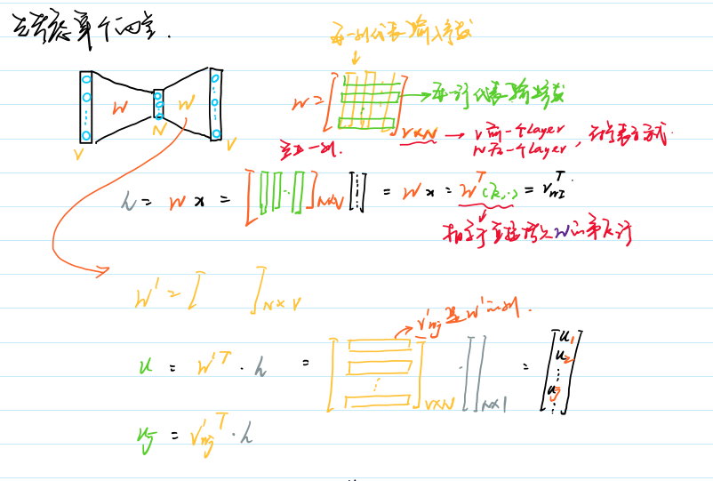

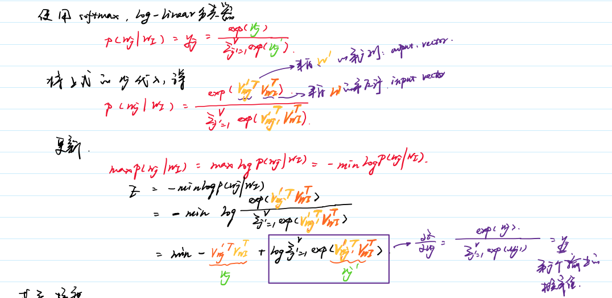

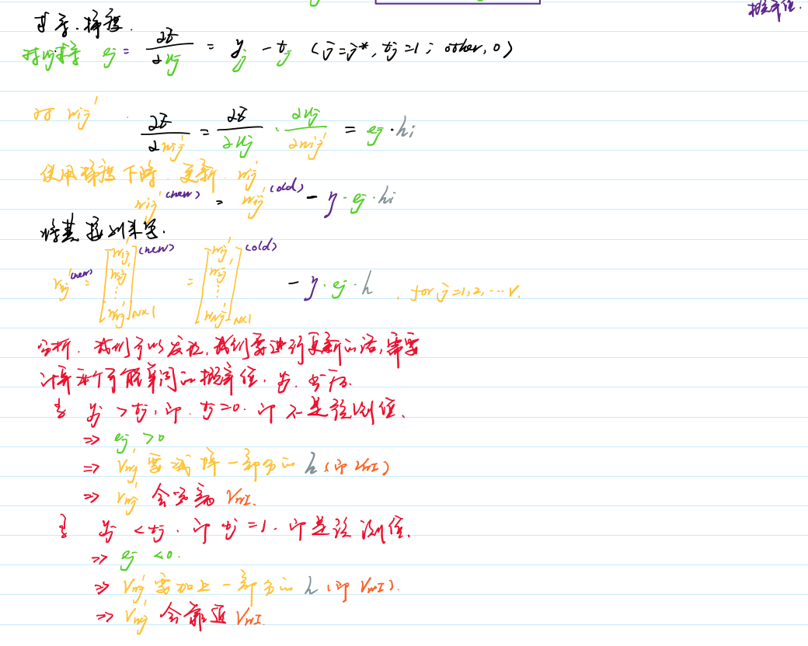

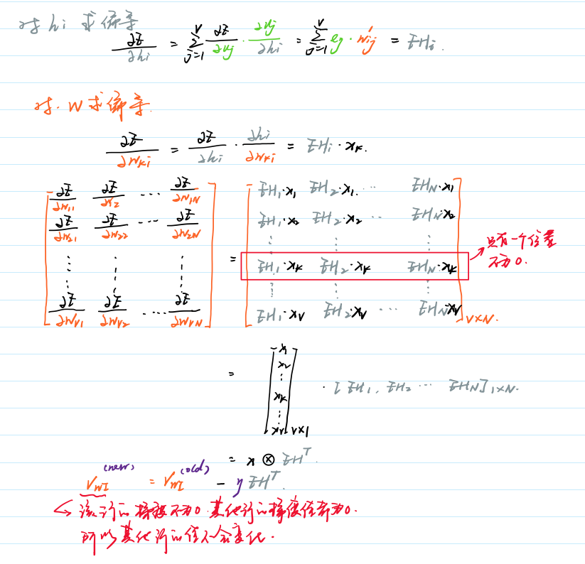

## Skip-Gram Model

### 例子

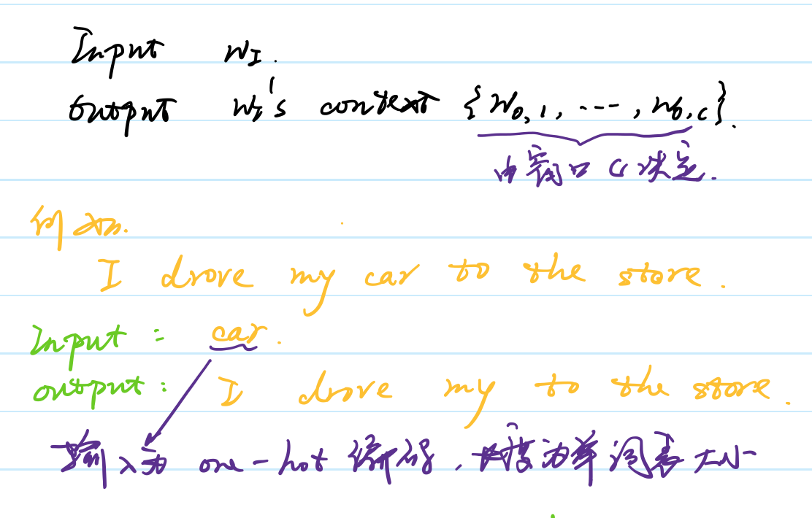

我们尝试去预测该词周边的词，预测多少个周边的词有窗口大小决定。

### 网络结构

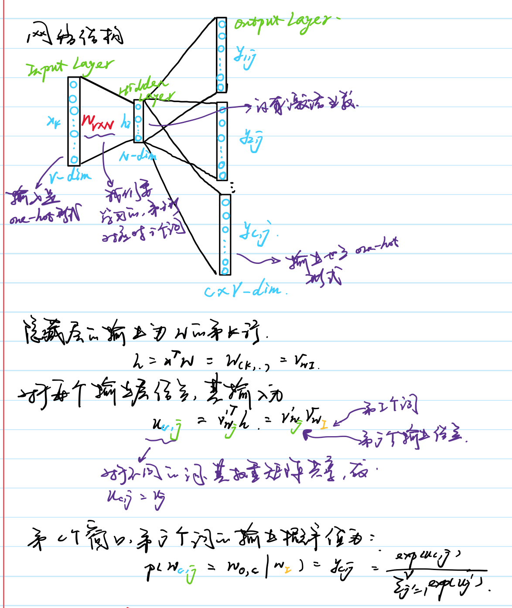

### 损失函数

### 优化器

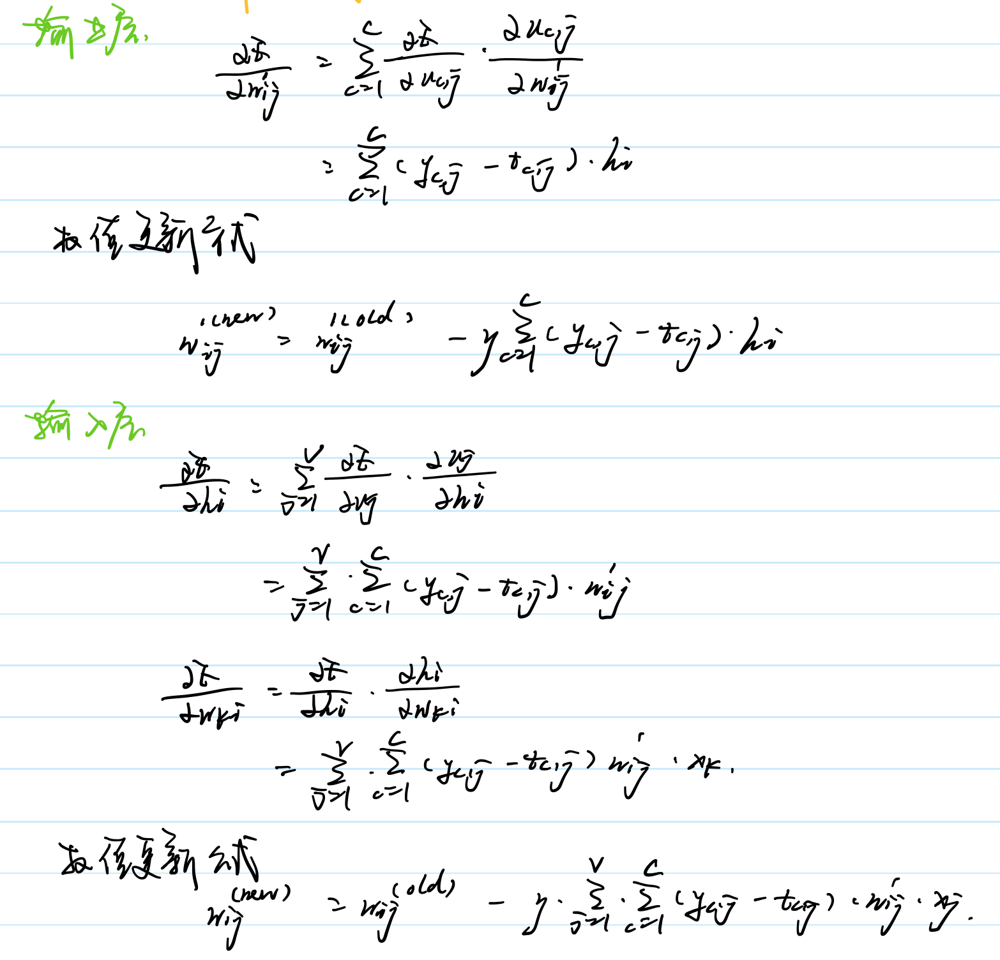

## The Continuous Bag-of-Words Model

### 网络结构

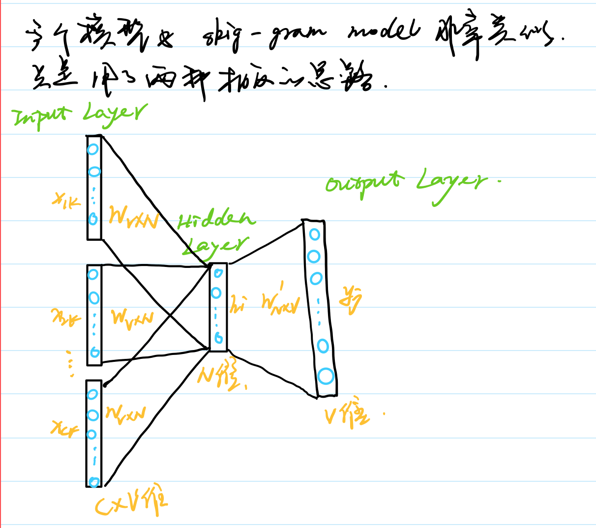

### 损失函数

### 优化

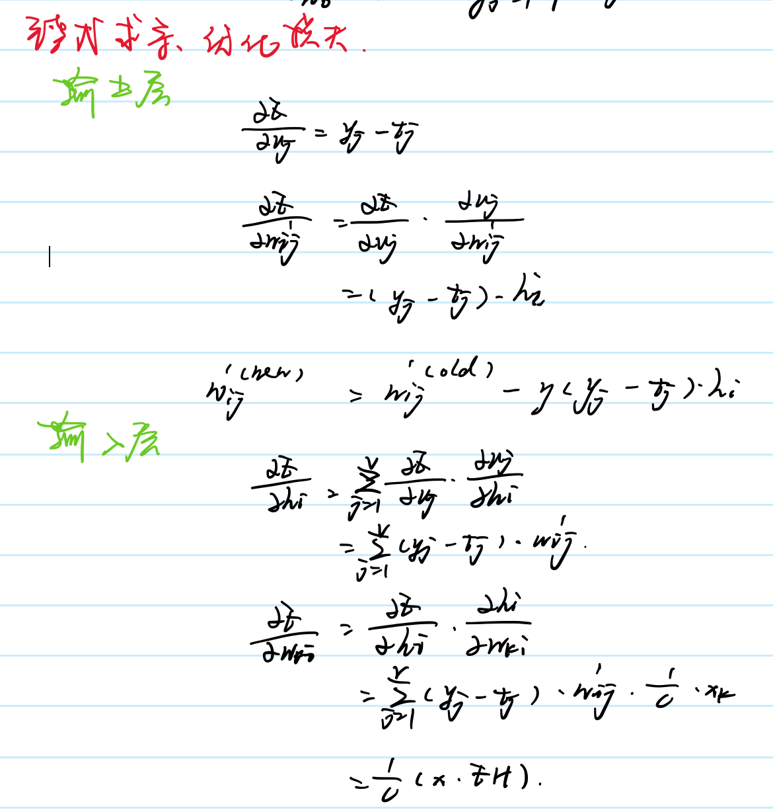

## Hierarchical Softmax

该方法不用为了获得概率分布而评估神经网络中的W个输出结点，而只需要评估大约$log_2(W)$个结点。**层次Softmax**使用一种二叉树结构来表示词典里的所有词，V个词都是二叉树的叶子结点，而这棵树一共有V−1个非叶子结点。

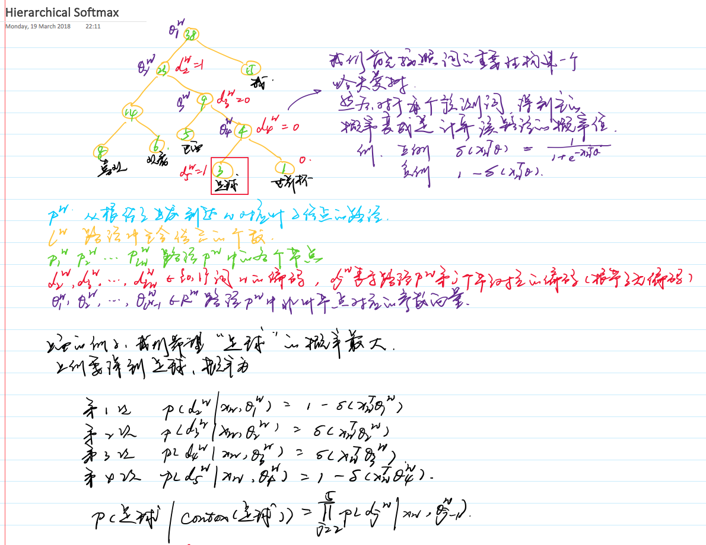

我们可以定义损失函数，实际上就是逻辑回归中的极大似然函数：

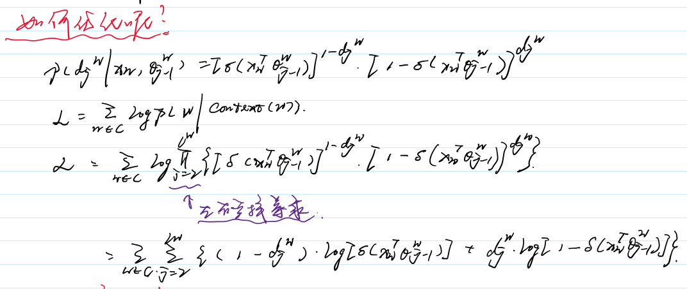

我们用梯度上升法求解：

## 负采样

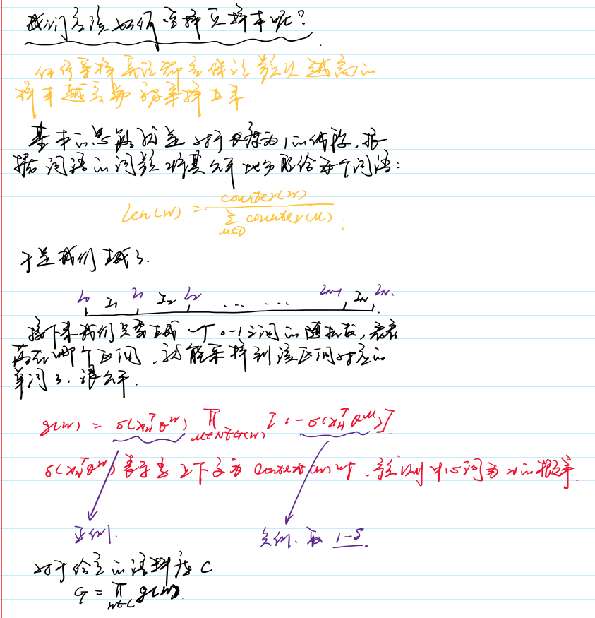

## 总结	

- skip-gram速度比较慢，但是对不平凡词效果比较好。CBOW比较快。窗口大小，skip-gram一般设置为10，CBOW设置为5。
- 层次softmax对不平凡词效果比较好，负采样对平凡词效果比较好，对低维度向量效果比较好。
- 对平凡词进行采样可以提高大数据集的正确率和速度。
- 词向量的维度通常来说，越高越好。
- 不管哪一种模型，其优化的目标函数都是**对数似然函数**。
- 隐层没有激活函数，或者说是线性的(y=x)。
- 层次softmax和负采样只是训练技巧，不是word2vec的精髓，采用这样技巧的原因在于，word2vec本质上是一个语言模型，它的输出节点数是V个，对应了V个词语，本质上是一个多分类问题。但实际当中，词语的个数非常非常多，会给计算造成很大困哪，所以需要用技巧来加速训练：
  - 层次softmax：本质上是把N分类问题变成$log_2N$次二分类。
  - 负采样：本质上预测总体类别的一个子集。

