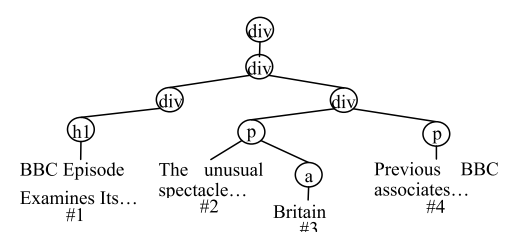
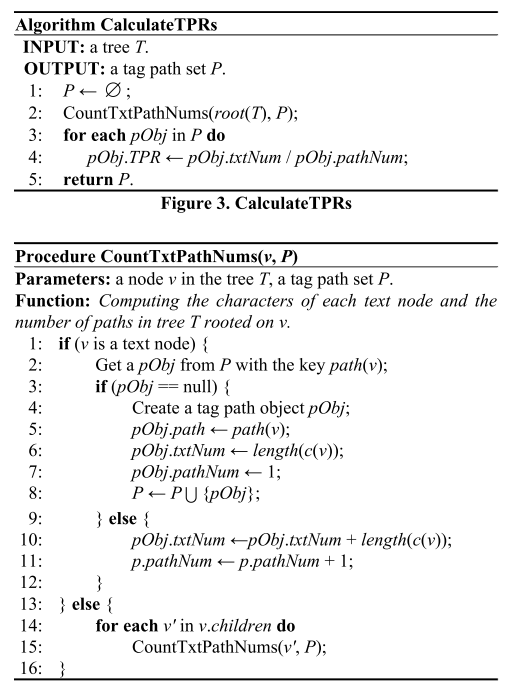

# Content Extraction via Path Ratios

该算法能够通过$TPR/ETPR$直方图快速、准确的从网页中提取新闻内容。

### Document Object Model

### Extended Labeled Ordered Tree

正文和噪声的主要区别有：

1. 正文通常只包含在一个部分中，但是噪声信息在很多部分中都会出现；
2. 正文通常都有相同的tag paths；

**定义：**

- $L=\{l_0,l_1,l_2,...\}$,$l_i$表示标记，即tag；
- $T=(V,E,v_0,\prec ,L,l(\cdot),c(\cdot))$
  - $l:V\rightarrow L$是label function，即求出节点所属的标签$l(v)$；
  - $c：V\rightarrow String$是content function，即求出节点的本文内容$c(v)$；

### Tag Path

$l(v_0),l(v_1)...l(v_k)$称为节点v的tag path，表示为$path(v)$。

### 特征提取

1. 正文节点有相似的tag paths；
2. 噪声节点有相似的tag paths；
3. 正文节点包含更多的文本数据；
4. 噪声节点包含更少的文本数据；
5. 所有的节点都是叶子节点；

### Text to Tag Path Ratio

- **pathNum**：tag path在tree T中出现的次数，这个概念比较容易造成误解，现在的理解是，叶节点是不算在tag path里面的。tag path是一个tag序列标识，这个序列标识是有可能重复的。
- **txtNum**：节点中所有字符的个数；
- $accNodes(p)=\{v_p^1,v_p^2,…,v_p^m\}$是tag path p上可访问的节点的集合；
- **Text to Tag Path Radio：**$TPR(p)=\frac{\sum_{v\in accNodes(p)}length(c(v))}{|accNodes(p)|}$
  - 对于包含长文本的路径，该值很高；
  - 对于其他路径，该值很低；

举例子说明：

上述文档图的TPR计算方式如下:

1. \#1 text node : `tag path = <div.div.div.h1>`，txtNum = 40, pathNum=1, TPR=40；
2. \#2 text node: `tag path = <div.div.div.p>`，txtNum=645，pathNum=2(因为这个序列出现两次)，TPR=322.5；
3. \#3 text node: `tag path=<div.div.div.p.a>`，txtNum=7，pathNum=1，TPR=7；
4. \#4 text node: `tag path=<div.div.div.p>`，txtNum=645，pathNum=2，TPR=322.5；

### 算法流程

